```{r setup, include=FALSE}
# Source the environment setup to install necessary packages and load libraries
packages <- c("knitr", "gt", "katex")

for (pkg in packages) {
  if (!suppressWarnings(require(pkg, character.only = TRUE))) {
    install.packages(pkg, dependencies = TRUE)
    library(pkg, character.only = TRUE)
  }
}

# Globally set settings and center all plots while displaying knitted version in HTML
knitr::opts_chunk$set(echo = FALSE, fig.align = "center")
```

## Agenda {.custom-smaller}

1.  Hintergrund zu den Framework Programmes

2.  Forschungfragen

3.  Daten und Netzwerke

4.  Methodik

5.  Ergebnisse

6.  Zusammenfassung der Erkenntnisse


##

::: {.center-slide}
**1. Hintergrund zu den Framework Programmes**
:::

## Hintergrund zu den Framework Programmes {.custom-smaller}

-   von 1983 bis 2019 insgesamt sieben Rahmenprogramme (FP1 bis FP7)

-   zu deutsch: *Rahmenprogramme für Forschung und Innovation*

::: {.columns}
::: {.column width="50%"}

-   [**Horizon 2020**]{.lmu-green} (**H2020**):

    -   Laufzeit: 2014 bis 2020
    -   Budget: 77 Milliarden Euro

```{r fig-pillars-h2020, out.width="100%", fig.cap="Säulen von Horizon 2020"}
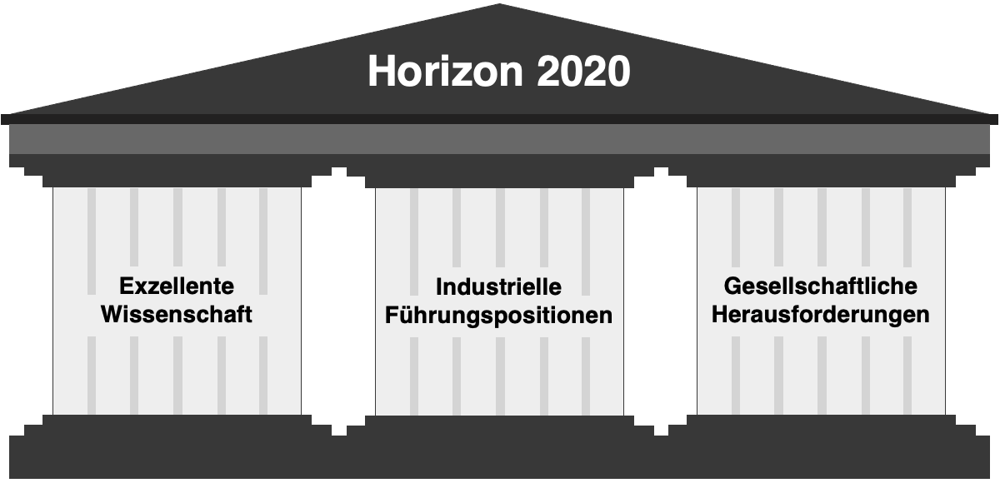
```
:::

::: {.column width="50%"}

-   [**Horizon Europe**]{.lmu-green} (**HORIZON**):

    -   Laufzeit: 2021 bis 2027
    -   Budget: 95 Milliarden Euro

```{r fig-pillars-horizon, out.width="100%", fig.cap="Säulen von Horizon Europe"}
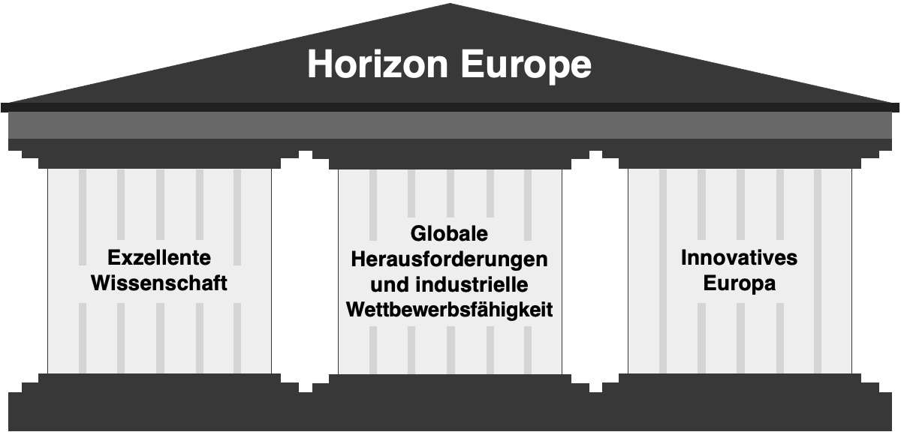
```
:::
:::

##

::: {.center-slide}
**2. Forschungfragen**
:::

## Forschungfragen {.custom-smaller}

<br>

::: {.rq1-block}
[**Forschungsfrage 1**]{.lmu-green}:

Wie entwickelt sich die strukturelle Topologie der Kollaborationsnetzwerke
auf Organisationsebene und länderaggregierter Ebene von H2020 zu HORIZON?
:::

[**Forschungsfrage 2**]{.lmu-green}:

Welcher Bedeutung kommt der Koordinatorenrolle in einem Förderprojekt bzgl. der 
Positionierung der koordinierenden Organisation in den Netzwerken bei?

##

::: {.center-slide}
**3. Daten und Netzwerke**
:::

## Daten {.custom-smaller}

-   Datensätze des *Informationsdiensts der Gemeinschaft für Forschung und Entwicklung*
(CORDIS) zu Organisationen/Projekten je Rahmenprogramm

::: {.columns}
::: {.column width="50%"}
-   Informationen zu **Projekten**:

    - Identifikationsnummer,
    - Start- und Enddatum,
    - Kostenaufwand,
    - Rahmenprogramm
:::

::: {.column width="50%"}
- Informationen zu **Organisationen**:

    - Identifikationsnummer,
    - Name,
    - Adresse und Koordinaten,
    - NUTS-Code,
    - Rolle
:::
:::

## Daten {.custom-smaller visibility="uncounted"}

-   Datensätze des *Informationsdiensts der Gemeinschaft für Forschung und Entwicklung*
(CORDIS) zu Organisationen/Projekten je Rahmenprogramm

::: {.columns}
::: {.column width="50%"}
-   Informationen zu **Projekten**:

    - [Identifikationsnummer]{.lmu-green},
    - Start- und Enddatum,
    - Kostenaufwand,
    - [Rahmenprogramm]{.lmu-green}
:::

::: {.column width="50%"}
- Informationen zu **Organisationen**:

    - [Identifikationsnummer]{.lmu-green},
    - [Name]{.lmu-green},
    - [Adresse und Koordinaten]{.lmu-green},
    - [NUTS-Code]{.lmu-green},
    - [Rolle]{.lmu-green}
:::
:::

-   Landeszugehörigkeit teilweise imputiert über ```nutsCode``` oder ```geolocation```

-   ergänzt um Bevölkerungszahlen des *UN World Population Prospects 2024*

## Netzwerke {.custom-smaller}

-   parallele Konstruktion für jeweiliges Rahmenprogramm
<br><br>
-   auf [**Organisationsebene**]{.lmu-green}: Projektion der bimodalen (Organisation $\times$ Projekt) Struktur auf unimodale (Organisation $\times$ Organisation) Netzwerke
    - Knoten: Organisationen
    - Kanten: Kollaborationen zwischen Organisationen
    - Gewicht: Anzahl an gemeinsamen Projekten

## Netzwerke {.custom-smaller visibility="uncounted"}

-   parallele Konstruktion für jeweiliges Rahmenprogramm
<br><br>
-   auf [**Organisationsebene**]{.lmu-green}: Projektion der bimodalen (Organisation $\times$ Projekt) Struktur auf unimodale (Organisation $\times$ Organisation) Netzwerke
    - Knoten: Organisationen
    - Kanten: Kollaborationen zwischen Organisationen
    - Gewicht: Anzahl an gemeinsamen Projekten
<br><br>
-   auf [**Länderebene**]{.lmu-green}: Aggregation der Organisationen zu Ländern (Land $\times$ Land)

    - Knoten: Länder
    - Kanten: Kollaborationen zwischen je mind. 1 Organisation aus Ländern
    - Gewicht: Paare an Organisationen oder Summe gemeinsamer Projekte

## 

::: {.center-slide}
**4. Methodik**
:::

## Methodik: Grad und Verteilung {.custom-smaller}

```{r tab-methods-degree, out.width="100%"}
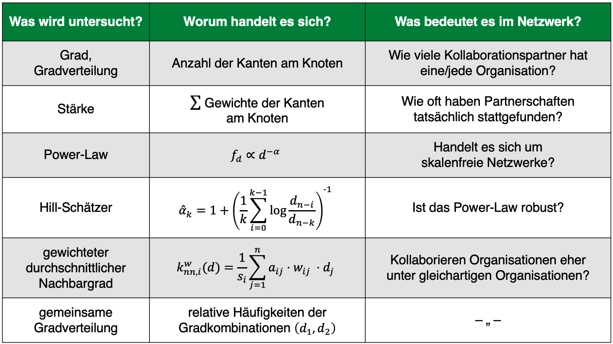
```

## Methodik: Kohäsion {.custom-smaller}

```{r tab-methods-cohesion, out.width="100%"}
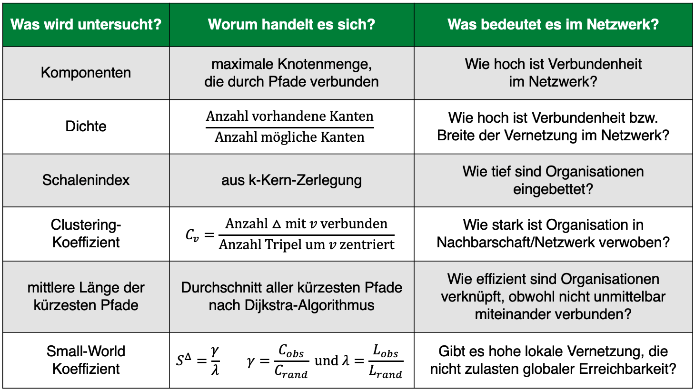
```

## Methodik: Zentralität und Koordination {.custom-smaller}

```{r tab-methods-centrality-coordination, out.width="100%"}
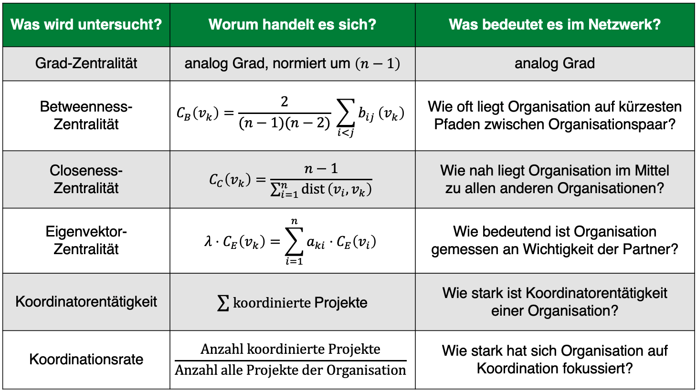
```

## Methodik: Länderebene und Visualisierung {.custom-smaller}

```{r tab-methods-country-visualisation, out.width="100%"}
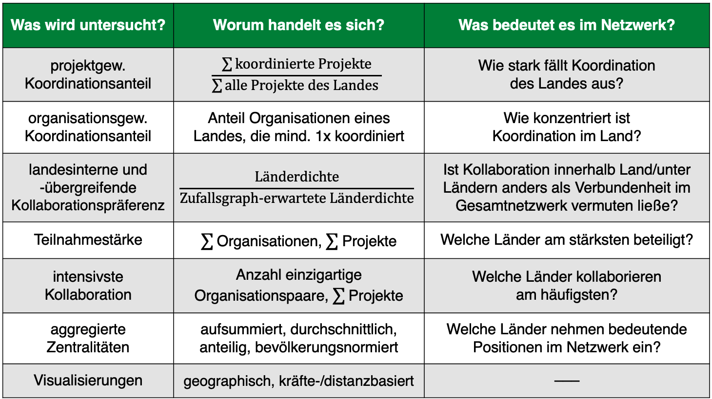
```


##

::: {.center-slide}
**5. Ergebnisse**
:::

## Rechtsschiefe Verteilungen der Grade {.custom-smaller}

```{r fig-degree-histogram, out.width="100%", fig.cap="Histogramme der absoluten Gradverteilungen für H2020 (*links*) und HORIZON (*rechts*)<br>auf Organisationsebene. Isolierte Knoten (Grad = 0) nicht berücksichtigt."}
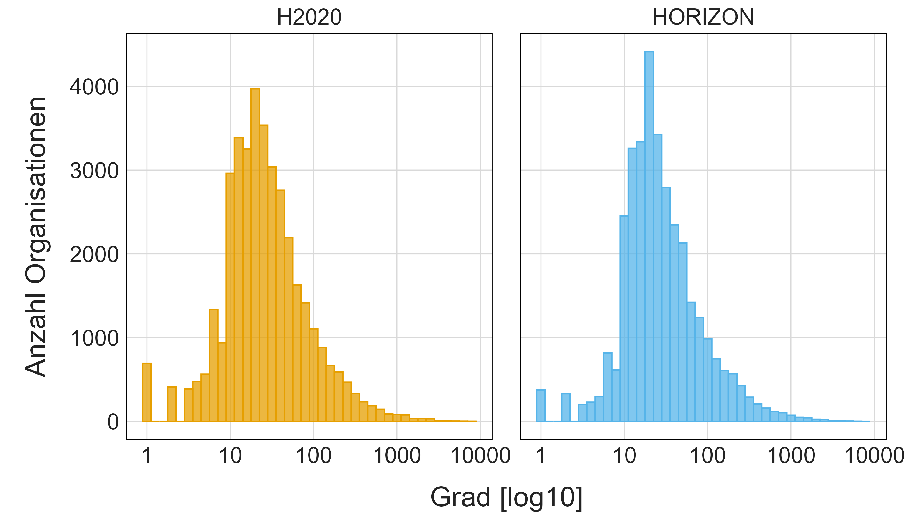
```

## Annähernd lineare Mitte der Gradverteilung {.custom-smaller}

```{r fig-degree-distribution, out.width="100%", fig.cap="Relative Gradverteilung für H2020 (*orange*) und HORIZON (*blau*). Isolierte Knoten sind nicht berücksichtigt. Vertikale Linien: Grad, ab dem erstmals < 50% der Organisationen nur 1x am FP teilnehmen."}
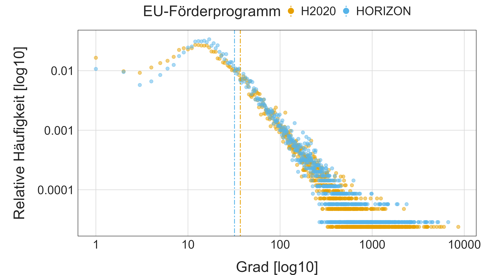
```

## Je riesige und viele sehr kleine Komponenten {.custom-smaller}

```{r fig-components, out.width="100%", fig.cap="Histogramm der Verteilung der Größe der Komponenten<br>in H2020 (*links*) und HORIZON (*rechts*) auf Organisationsebene."}
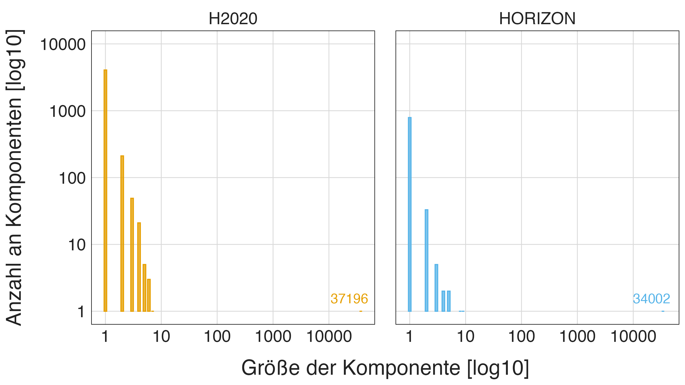
```

## Small-World-Eigenschaft der Netzwerke {.custom-smaller}

-   globaler Clustering-Koeffizient:
    $$\qquad \quad \ \ \ C_{obs}^{\text{H2020}} \approx 0.13 \approx C_{obs}^{\text{HORIZON}}$$

-   durchschnittliche Länge der kürzesten Pfade:
    $$\qquad \quad \ \ \ L_{obs}^{\text{H2020}} \approx 2.75\qquad \text{und} \qquad L_{obs}^{\text{HORIZON}} \approx 2.72$$

$\Longrightarrow$ Small-World-Koeffizient mit [**Erdos-Rényi-Modell**]{.lmu-green}:
$$S_{ER}^{\Delta, \text{H2020}} \approx 79.76 \qquad \text{und} \qquad S_{ER}^{\Delta, \text{HORIZON}} \approx 75.37$$

$\Longrightarrow$ Small-World-Koeffizient mit [**Viger-Latapy-Modell**]{.lmu-green}:
$$S_{VL}^{\Delta, \text{H2020}} \approx 2.69 \qquad \text{und} \qquad S_{VL}^{\Delta, \text{HORIZON}} \approx 2.67$$

## Betweenness & Grad: positive Zusammenhänge {.custom-smaller}

```{r fig-betweenness-degree, out.width="100%", fig.cap="Betweenness- gegen Grad-Zentralität für H2020 (*links*) und HORIZON (*rechts*) auf Organisationsebene. Isolierte Knoten sind nicht berücksichtigt."}
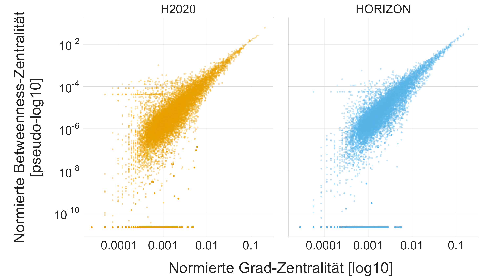
```

## Eigenvektor & Grad: positive Zusammenhänge {.custom-smaller}

```{r fig-eigenvector-degree, out.width="100%", fig.cap="Eigenvektor- gegen Grad-Zentralität für H2020 (*links*) und HORIZON (*rechts*) auf Organisationsebene. Isolierte Knoten sind nicht berücksichtigt."}
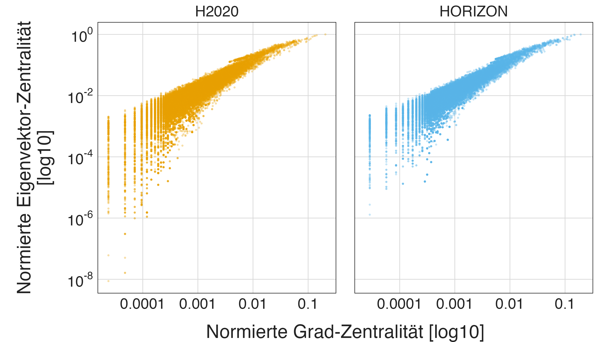
```

## Zentralität & Koordination: positive Beziehung {.custom-smaller}

```{r fig-centrality-coordinator, out.width="100%", fig.cap="Häufigkeit der Koordinatorentätigkeit einer Organisation gegen ihre Zentralität für H2020 (*links*) und HORIZON (*rechts*). Isolierte Knoten für Grad-Zentralität nicht berücksichtigt."}
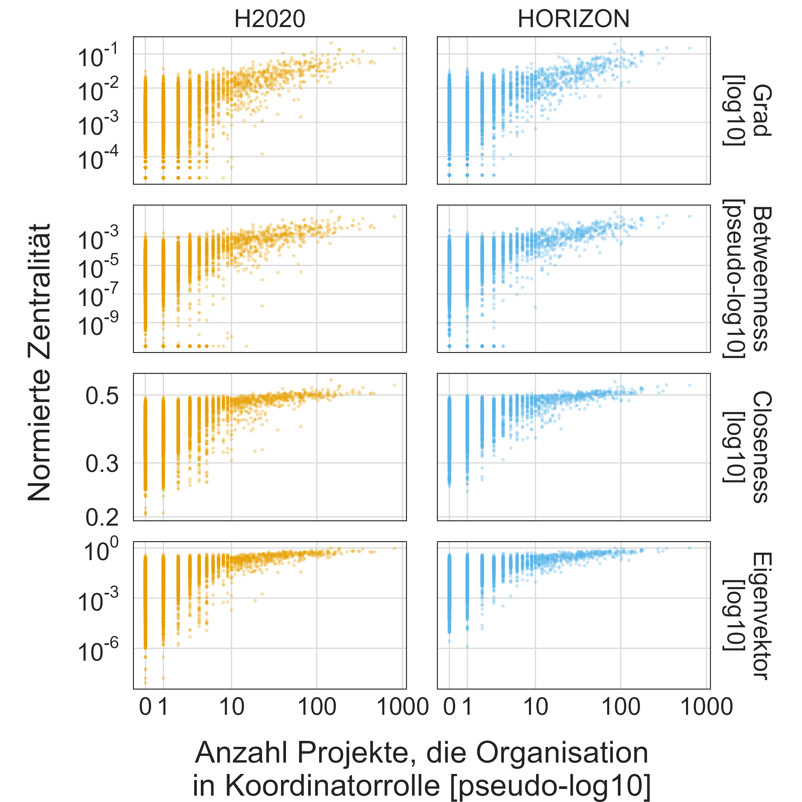
```

## Dominanz der west-/mitteleuropäischen Länder {.custom-smaller}

```{r fig-rank-evolution-countries-sum, out.width="100%", fig.cap="Entwicklung der Rangfolge der EU-Länder nach summierter Zentralität<br>von H2020 (*je linke Spalte*) zu HORIZON (*je rechte Spalte*)."}
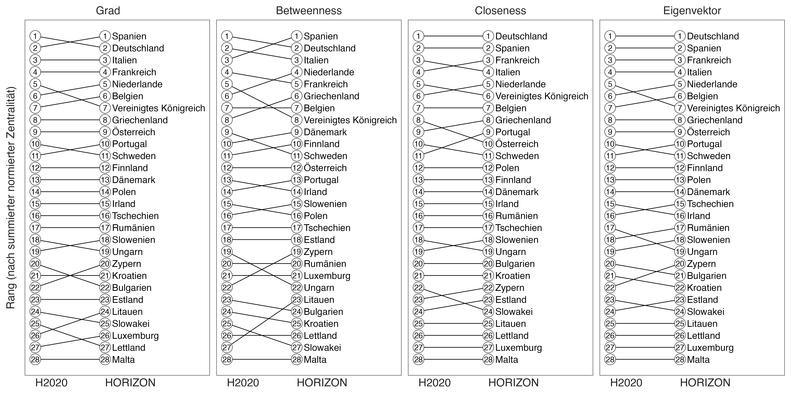
```

## Stark vernetzter west-/mitteleuropäischer Kern {.custom-smaller}

```{r fig-map-EU-h2020, out.width="100%", fig.cap="Geographische Karte der Kollaborationen auf Länderebene für **H2020** unter <br>europäischem Fokus. Kanten: Vereinigung aus maximalem Spannbaum und $n-1$ stärksten Gewichten.<br>Knotengröße: Anzahl Verbindungen. Kantenbreite: Anzahl gemeinsame Projekte."}
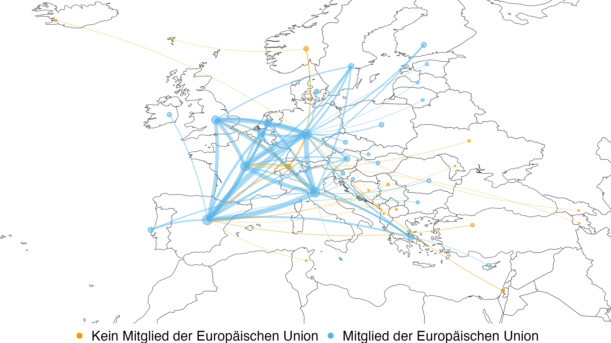
```

## Stark vernetzter west-/mitteleuropäischer Kern {.custom-smaller visibility="uncounted"}

```{r fig-map-EU-horizon, out.width="100%", fig.cap="Geographische Karte der Kollaborationen auf Länderebene für **HORIZON** unter<br>europäischem Fokus. Kanten: Vereinigung aus maximalem Spannbaum und $n-1$ stärksten Gewichten.<br>Knotengröße: Anzahl Verbindungen. Kantenbreite: Anzahl gemeinsame Projekte."}
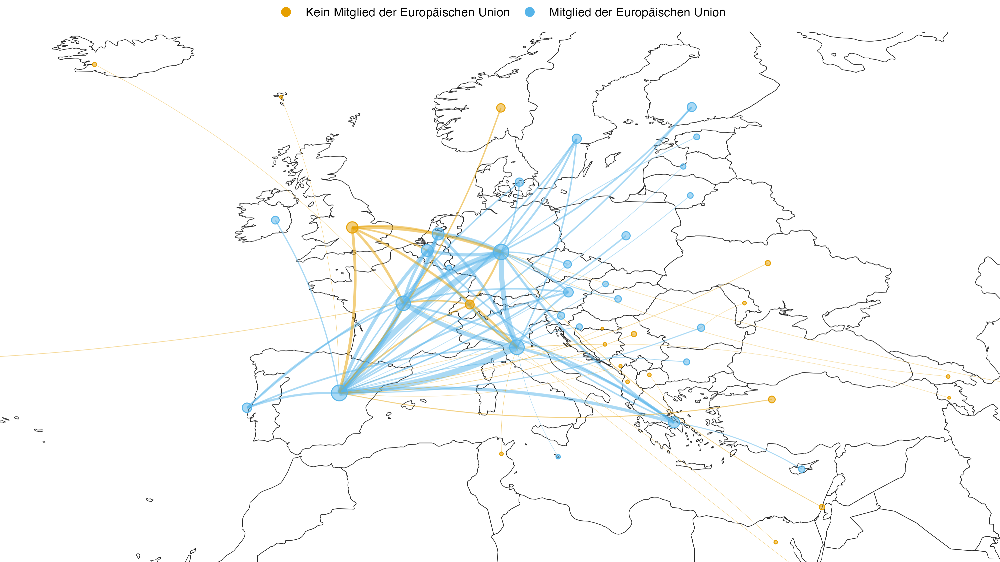
```

## Kräftebasiert nahezu derselbe Kern an Ländern {.custom-smaller}

```{r fig-abstract-EU-h2020, out.width="100%", fig.cap="Kräftebasierte Positionierung der Kollaborationen auf Länderebene für **H2020** unter<br>europäischen Fokus mittels Fruchterman-Reingold. Kanten: Vereinigung aus maximalem Spannbaum und $n-1$ stärksten Gewichten. Knotengröße: Anzahl Verbindungen. Kantenbreite: Anzahl gemeinsame Projekte."}
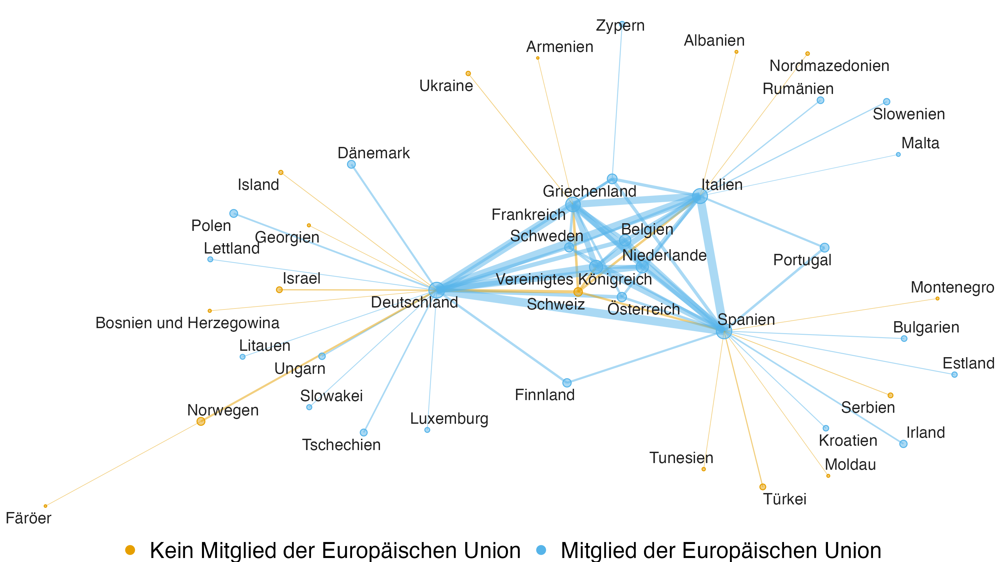
```

## Kräftebasiert nahezu derselbe Kern an Ländern {.custom-smaller visibility="uncounted"}

```{r fig-abstract-EU-horizon, out.width="100%", fig.cap="Kräftebasierte Positionierung der Kollaborationen auf Länderebene für **HORIZON** unter europäischen Fokus mittels Fruchterman-Reingold. Kanten: Vereinigung aus maximalem Spannbaum und $n-1$ stärksten Gewichten. Knotengröße: Anzahl Verbindungen. Kantenbreite: Anzahl gemeinsame Projekte."}
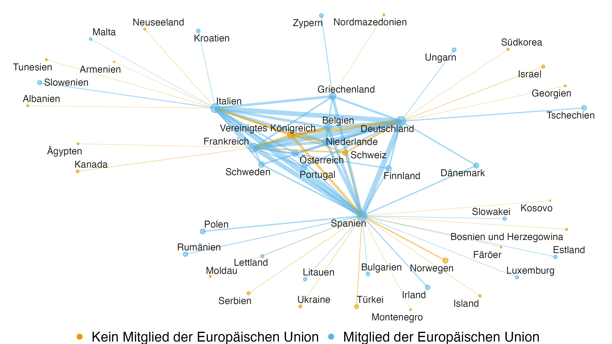
```

## 

::: {.center-slide}
**6. Zusammenfassung<br>der Erkenntnisse**
:::

## Zusammenfassung der Erkenntnisse {.custom-smaller}

<br>

::: {.rq1-block}
[**Forschungsfrage 1**]{.lmu-green}: *Entwicklung der Netzwerktopologie* 

-   keine grundlegenden Veränderungen in Art, wie einzelne Organisationen im Netzwerk verbunden, noch wie sich führender Länderkern zusammensetzt

-   geringfügige Änderungen als *„evolution, not a revolution"* [^1] zu interpretieren, gepaart mit Fortführung der etablierten Kollaborationseigenschaften
:::

[**Forschungsfrage 2**]{.lmu-green}: *Bedeutung der Koordinatorentätigkeit*

-   positive Zusammenhänge zwischen Koordinatorentätigkeit und der Position einer koordinierenden Organisation innerhalb der Rahmenprogramme

-   über Programme hinweg kein automatischer Rückschluss aus Koordination auf andauernd bedeutendere Positionierung einer Organisation möglich

[^1]: GD RTD und Europäische Kommission (2018)

## Literaturverzeichnis {.refs-slide .scrollable}

::: {#refs}
:::

<!-- ################################################################################# -->
<!-- ##################################### ANHANG #################################### -->
<!-- ################################################################################# -->

##

::: {.center-slide}
**Anhang**
:::

## Europäisches Fokuszentrum der Kollaborationen {.custom-smaller}

```{r app-network-h2020, out.width="100%", fig.cap="Abbildung A1a: Geographsiche Karte aller Kollaborationen auf Organisationsebene für **H2020**.<br>Organisationen ohne Koordinaten (1869) nicht berücksichtigt."}
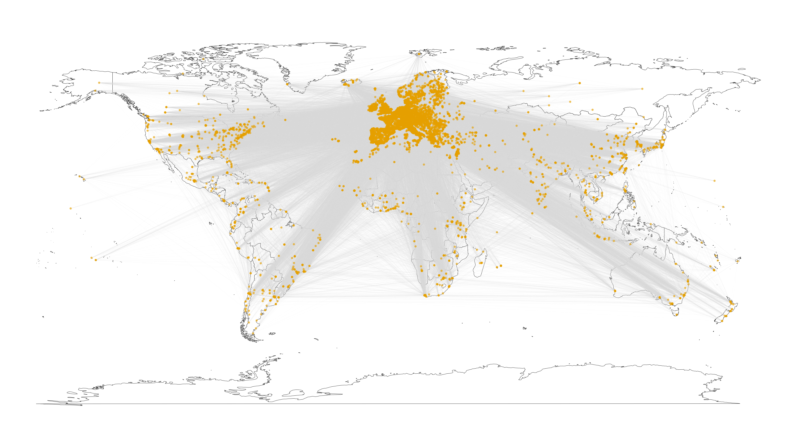
```

## Europäisches Fokuszentrum der Kollaborationen {.custom-smaller visibility="uncounted"}

```{r app-network-horizon, out.width="100%", fig.cap="Abbildung A1b: Geographsiche Karte aller Kollaborationen auf Organisationsebene für **HORIZON**.<br>Organisationen ohne Koordinaten (1975) nicht berücksichtigt."}
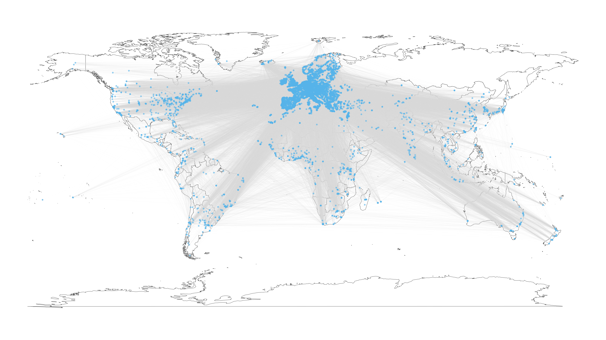
```

## Geringe Unterschiede in allgemeinen Statistiken {.custom-smaller}
<br><br><br><br>
```{r app-degree-strength, out.width="100%"}
data <- data.frame(
  "col1" = c("H2020", "HORIZON"),
  "col2" = c(54.96, 59.66),
  "col3" = c(20, 23),
  "col4" = c(8617, 6694),
  "col5" = c(170.20, 168.81),
  "col6" = c(77.54, 74.98),
  "col7" = c(21, 23),
  "col8" = c(20089, 13843),
  "col9" = c(347.67, 287.66)
)

data %>%
  gt() %>%
  tab_caption(caption = "Tabelle A1: Grundlegende Kennzahlen zu Grad und Stärke auf Organisationsebene") %>%
  tab_options(table.font.size = px(24)) %>%
  cols_width(everything() ~ pct(15)) %>%
  cols_label(col1 = md(""),
             col2 = md("$\\bar{d}$"),
             col3 = md("$d_{med}$"),
             col4 = md("$\\max(d)$"),
             col5 = md("$\\text{sd}(d)$"),
             col6 = md("$\\bar{s}$"),
             col7 = md("$s_{med}$"),
             col8 = md("$\\max(s)$"), 
             col9 = md("$\\text{sd}(s)$"))
```

## Rechtsschiefe Verteilungen der Stärke {.custom-smaller}

```{r app-strength-histogram, out.width="100%", fig.cap="Abbildung A2: Histogramme der Stärkeverteilungen für H2020 (*links*) und HORIZON (*rechts*)<br>auf Organisationsebene. Isolierte Knoten (Stärke = 0) nicht berücksichtigt."}
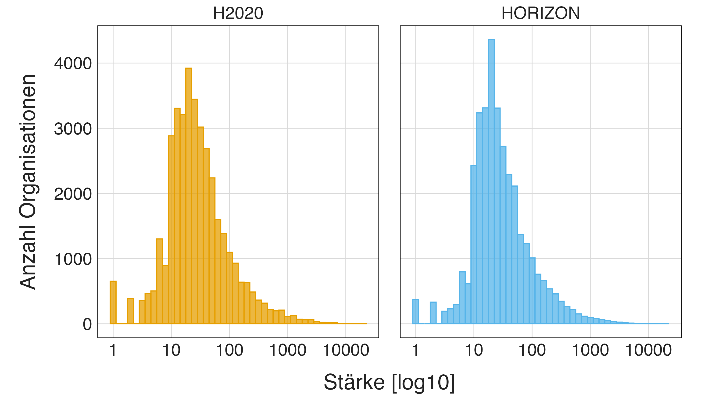
```

## Trichterförmige Verteilung der Nachbargrade {.custom-smaller}

```{r app-knn, out.width="100%", fig.cap="Abbildung A3: Assortativität zwischen Grad einer Organisation und ihrer Nachbarn<br>für H2020 (*links*) und HORIZON (*rechts*). Isolierte Knoten sind nicht berücksichtigt."}
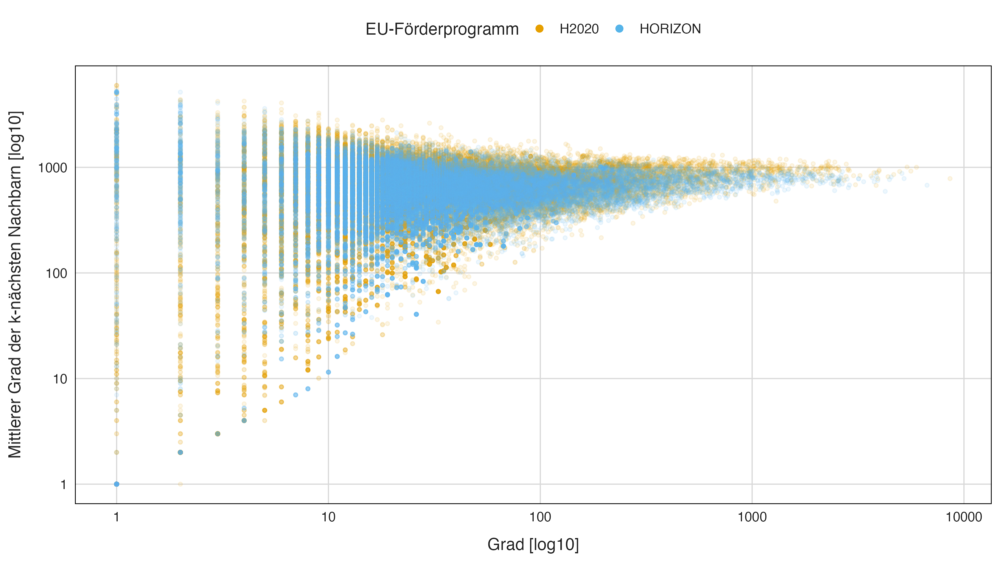
```

## Abfall einmaliger Teilnahmeanteil ab Grad 26-50 {.custom-smaller}
<br><br><br><br>
```{r app-degree-onetimer, out.width="100%"}
data <- data.frame(
  "label"       = c("H2020", "HORIZON"),
  "deg_1"       = c(84.25, 95.19),
  "deg_2"       = c(81.51, 95.18),
  "deg_3"       = c(79.33, 87.06),
  "deg_4"       = c(85.05, 89.18),
  "deg_5"       = c(83.87, 92.91),
  "deg_6"       = c(90.75, 90.24),
  "deg_7"       = c(89.00, 95.19),
  "deg_8"       = c(88.18, 94.96),
  "deg_9"       = c(90.81, 94.35),
  "deg_10"      = c(89.64, 95.78),
  "deg_11_25"   = c(82.76, 88.94),
  "deg_26_50"   = c(50.03, 50.34),
  "deg_51_100"  = c(17.33, 16.34),
  "deg_100plus" = c(2.53, 1.92)
)

data %>%
  gt() %>%
  tab_caption(caption = "Tabelle A2: Anteil der ausschließlich an einem Projekt teilnehmenden Organisationen je Grad je Rahmenprogramm [%].") %>%
  tab_options(table.font.size = px(20)) %>%
  cols_align(align = "center", columns = everything()) %>%
  tab_spanner(label = "Grad", columns = c(deg_1, deg_2, deg_3, deg_4, deg_5, deg_6, deg_7, deg_8,
                                            deg_9, deg_10, deg_11_25, deg_26_50, deg_51_100, deg_100plus)) %>%
  cols_label(
    label       = md(""),
    deg_1       = md("1"),
    deg_2       = md("2"),
    deg_3       = md("3"),
    deg_4       = md("4"),
    deg_5       = md("5"),
    deg_6       = md("6"),
    deg_7       = md("7"),
    deg_8       = md("8"),
    deg_9       = md("9"),
    deg_10      = md("10"),
    deg_11_25   = md("11-25"),
    deg_26_50   = md("26-50"),
    deg_51_100  = md("51-100"),
    deg_100plus = md("100+")
  ) %>%
  cols_width(label ~ pct(5), deg_51_100 ~ pct(8))
```

## Stagnierende Konsortiumsgrößen {.custom-smaller}

```{r app-consortiumsize, out.width="100%", fig.cap="Abbildung A4: Konsortiumsgröße gegen Grad einer Organisation für H2020 (*links*) und HORIZON (*rechts*). Organisationen mit einer Teilnahme per definitionem Konsortiumgröße = Grad + 1. Farbliche Kodierung, ob an einem (*blau*) oder mehreren (*orange*) Projekten beteiligt. Isolierte Knoten nicht berücksichtigt."}
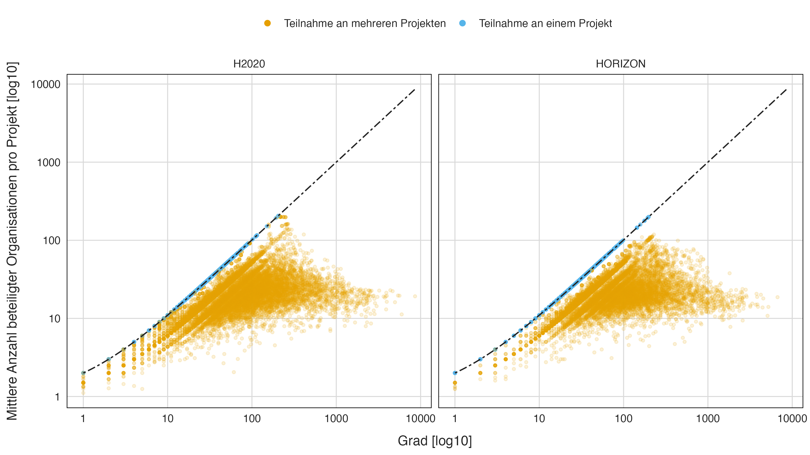
```

## Stabile Bereiche bei $\hat{\alpha}_k \approx$ 2.40 {.custom-smaller}

```{r app-hill, out.width="100%", fig.cap="Abbildung A5: Hill-Diagramm der Maximum-Likelihood-Schätzungen $\\hat{\\alpha}_k$ des Power-Law Skalierungsparameters als Funktion von $k$, der Anzahl der größten Gradbeobachtungen für H2020 (*links*) und HORIZON (*rechts*)."}
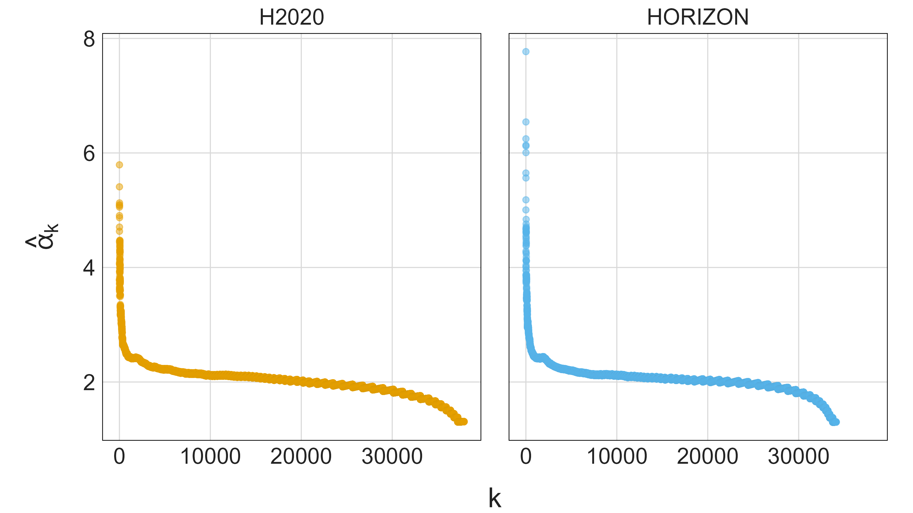
```

## Geringe Konzentration höherer Grade {.custom-smaller}

```{r app-distribution-matrix, out.width="100%", fig.cap="Abbildung A6: Heatmap der gemeinsamen Gradverteilung einer Organisation und ihrer Nachbarn<br>für H2020 (*links*) und HORIZON (*rechts*)."}
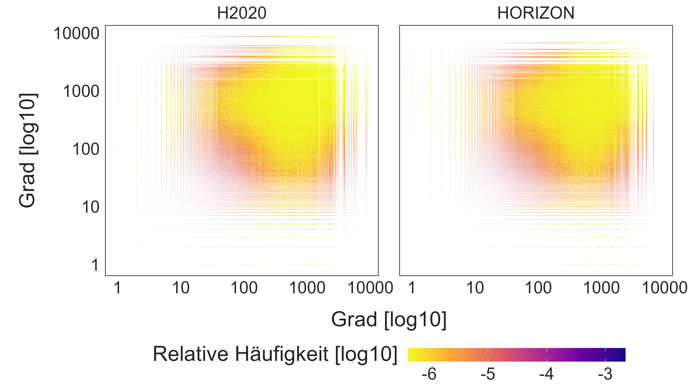
```

## Sinkendes Clustering bei steigendem Grad {.custom-smaller}

```{r app-clustering-degree, out.width="100%", fig.cap="Abbildung A7: Lokaler Clustering-Koeffizient gegen Grad einer Organisation für H2020 (*links*) und<br>HORIZON (*rechts*) auf Organisationsebene. Nur Organisationen mit Grad > 1 berücksichtigt."}
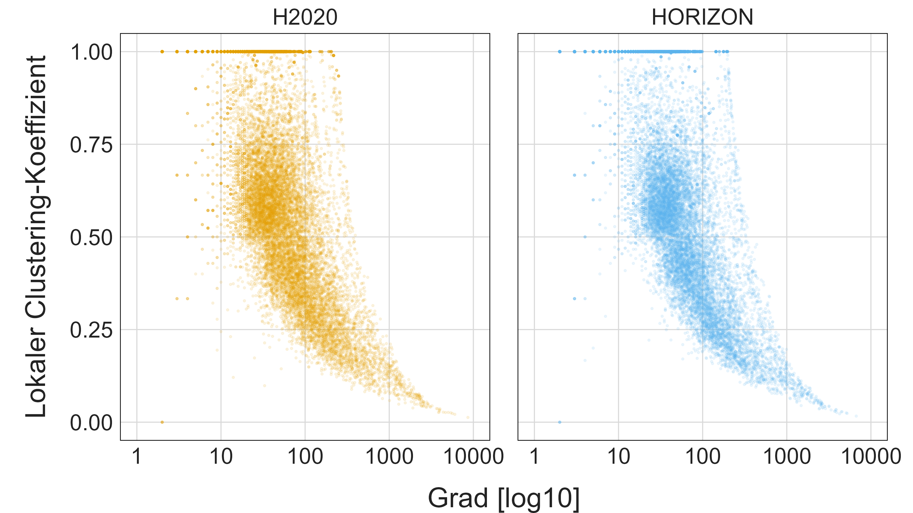
```

## Steigender Schalenindex bei steigendem Grad {.custom-smaller}

```{r app-coreness-degree, out.width="100%", fig.cap="Abbildung A8: Schalenindex der $k$-Kern-Zerlegung gegen Grad einer Organisation für H2020 (*links*) und<br>HORIZON (*rechts*) auf Organisationsebene. Isolierte Knoten sind nicht berücksichtigt."}
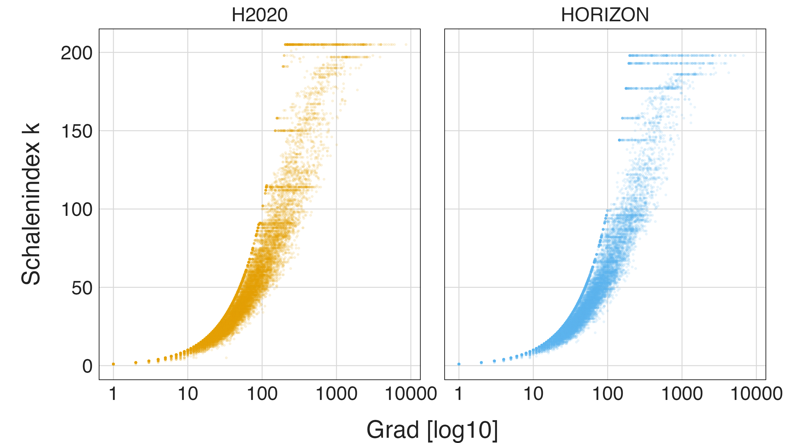
```

## Simulierte $<$ beobachtete Clustering-Koeffizient {.custom-smaller}

```{r app-smallworld-clustering, out.width="100%", fig.cap="Abbildung A9a: Histogramm der Simulation des lokalen Clustering-Koeffizienten für den Small-World-Koeffizienten des Erdos-Rényi-Referenzmodells (*linke Spalte*) und des Viger-Latapy-Konfigurationsmodells (*rechte Spalte*) für H2020 (*obere Zeile*) und HORIZON (*untere Zeile*) auf Organisationsebene.<br>Vertikale Linien: beobachtete Werte je Rahmenprogramm."}
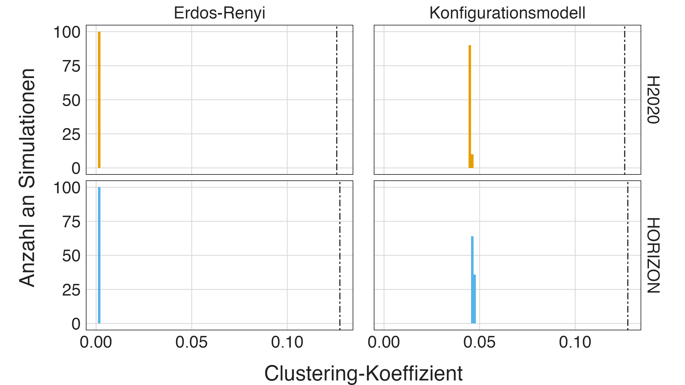
```

## Simulierte $\approx$ beobachtete kürzeste Pfadlänge {.custom-smaller visibility="uncounted"}

```{r app-smallworld-pathlength, out.width="100%", fig.cap="Abbildung A9b: Histogramm der Simulation der mittleren Länge der kürzesten Pfade für den Small-World-Koeffizienten des Erdos-Rényi-Referenzmodells (*linke Spalte*) und des Viger-Latapy-Konfigurationsmodells (*rechte Spalte*) für H2020 (*obere Zeile*) und HORIZON (*untere Zeile*) auf Organisationsebene.<br>Vertikale Linien: beobachtete Werte je Rahmenprogramm."}
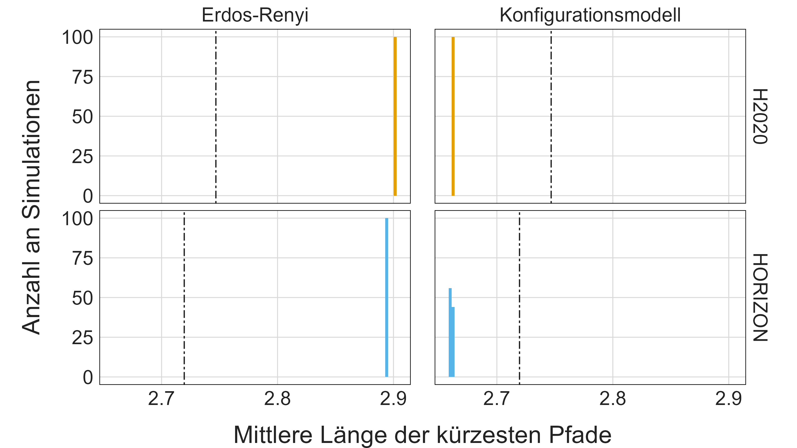
```

## Überwiegende Übereinstimmung der Varianten {.custom-smaller}
<br><br>
```{r app-centrality-overlap, out.width="100%"}
data <- data.frame(
  "n"              = c(25, 50, 100, 250, 1000),
  "h2020_between"  = c(80.0, 78.0, 84.0, 76.4, 74.2),
  "h2020_close"    = c(60.0, 66.0, 71.0, 72.0, 69.0),
  "h2020_eigen"    = c(68.0, 82.0, 81.0, 87.2, 87.1),
  "horizon_between" = c(80.0, 84.0, 81.0, 79.6, 78.2),
  "horizon_close"   = c(60.0, 60.0, 71.0, 70.8, 70.1),
  "horizon_eigen"   = c(76.0, 82.0, 84.0, 87.2, 84.0)
)

data %>%
  gt() %>%
  tab_caption(caption = "Tabelle A3: Anteil übereinstimmender (= Schnittmenge) Organisationen unter den n ranghöchsten Organisationen zwischen un-/gewichteter Ausführung je Zentralitätsmaß und Rahmenprogramm [%].") %>%
  tab_options(table.font.size = px(24)) %>%
  cols_align(align = "center", columns = everything()) %>%
  tab_spanner(label = "H2020", columns = c(h2020_between, h2020_close, h2020_eigen)) %>%
  tab_spanner(label = "HORIZON", columns = c(horizon_between, horizon_close, horizon_eigen)) %>%
  cols_label(
    n               = md("$n$"),
    h2020_between   = md("Betweenness"),
    h2020_close     = md("Closeness"),
    h2020_eigen     = md("Eigenvektor"),
    horizon_between = md("Betweenness"),
    horizon_close   = md("Closeness"),
    horizon_eigen   = md("Eigenvektor")
  )
```

## Hohe Rangkorrelationen der Zentralitäten {.custom-smaller}

```{r app-centrality-corr-mat, out.width="100%", fig.cap="Abbildung A10: Spearman-Rangkorrelationsmatrix der Zentralitätsmaße für H2020 (*links*) und HORIZON (*rechts*)"}
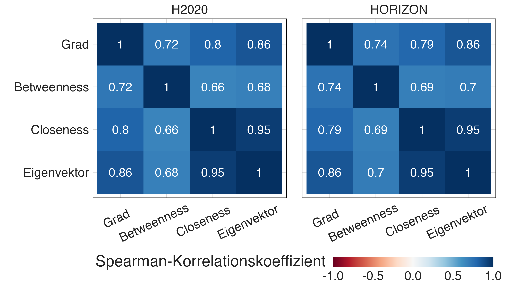
```

## Hohe Fluktuation in Koordinatorentätigkeit {.custom-smaller}

```{r app-contingency-table, out.width="100%"}
data <- data.frame(
  "row_label" = c("Nicht vorhanden", "Teilnehmer", "Koordinator", ""),
  "nv"        = c("---", 22023, 5264, 27287),
  "teil"      = c(18958, 10240, 1801, 30999),
  "koord"     = c(1269, 777, 1864, 3910),
  "gesamt"    = c(20227, 33040, 8929, 62196)
)

gt(data, rowname_col = "row_label") %>%
  tab_caption(caption = "Tabelle A4: Kontingenztafeln der Koordinatorentätigkeiten in H2020 und HORIZON") %>%
  tab_stubhead(label = "H2020") %>%
  tab_spanner(label = "HORIZON", columns = c(nv, teil, koord)) %>%
  cols_label(
    nv     = md("Nicht vorhanden"),
    teil   = md("Teilnehmer"),
    koord  = md("Koordinator"),
    gesamt = md("")
  ) %>%
  tab_options(table.font.size = px(24)) %>%
  cols_align(align = "center", columns = everything()) %>%
  cols_width(everything() ~ pct(20))

data <- data.frame(
  "row_label" = c("Nicht vorhanden", "Teilnehmer", "Koordinator", ""),
  "nv"        = c("---", "35.41%", "8.46%", "43.87%"),
  "teil"      = c("30.48%", "16.46%", "2.90%", "49.84%"),
  "koord"     = c("2.04%", "1.25%", "3.00%", "6.29%"),
  "gesamt"    = c("32.52%", "53.12%", "14.36%", "100%")
)

gt(data, rowname_col = "row_label") %>%
  tab_stubhead(label = "H2020") %>%
  tab_spanner(label = "HORIZON", columns = c(nv, teil, koord)) %>%
  cols_label(
    nv     = md("Nicht vorhanden"),
    teil   = md("Teilnehmer"),
    koord  = md("Koordinator"),
    gesamt = md("")
  ) %>%
  tab_options(table.font.size = px(24)) %>%
  cols_align(align = "center", columns = everything()) %>%
  cols_width(everything() ~ pct(20))
```

## Hohe Fluktuation in Koordinatorentätigkeit {.custom-smaller visibility="uncounted"}

```{r app-contingency-figure, out.width="100%", fig.cap="Abbildung A11: 3 $\\times$ 3 Rasterdiagramm der Verteilung nach Koordinatenstatus in H2020 und HORIZON."}
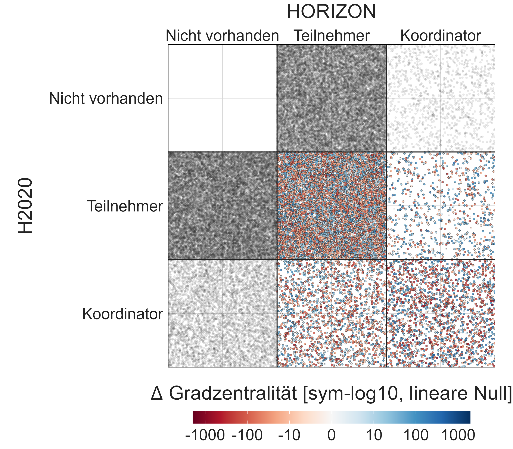
``` 

## Hohe Zentralität bei andauernder Koordination {.custom-smaller}

```{r app-persistence-centrality, out.width="100%", fig.cap="Abbildung A12: Entwicklung der Zentralitäten von H2020 zu HORIZON hinsichtlich der Koordinatorentätigkeit<br>einer Organisation in den jeweiligen Rahmenprogrammen."}
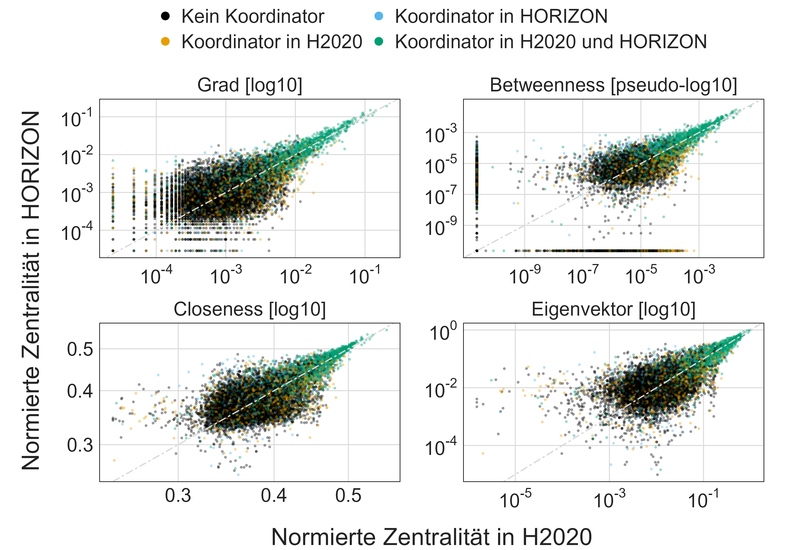
```

## Höchste Zentralität durchweg bei Koordination {.custom-smaller}

```{r app-persistence-degree, out.width="100%", fig.cap="Abbildung A13a: Entwicklung der Grad-Zentralität von H2020 zu HORIZON hinsichtlich der<br>Koordinatorentätigkeit einer Organisation in den jeweiligen Rahmenprogrammen."}
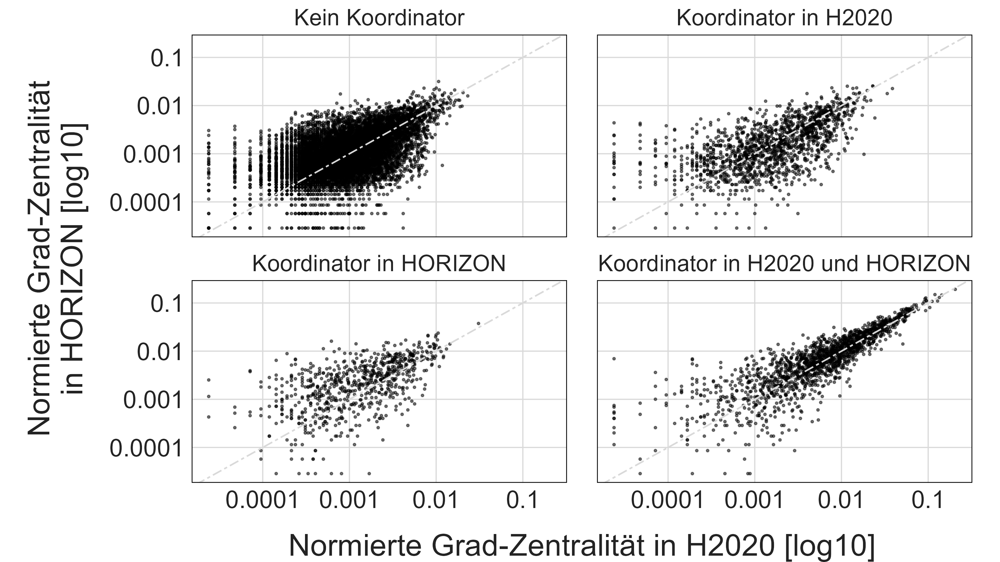
```

## Höchste Zentralität durchweg bei Koordination {.custom-smaller visibility="uncounted"}

```{r app-persistence-betweenness, out.width="100%", fig.cap="Abbildung A13b: Entwicklung der Betweenness-Zentralität von H2020 zu HORIZON hinsichtlich der Koordinatorentätigkeit einer Organisation in den jeweiligen Rahmenprogrammen."}
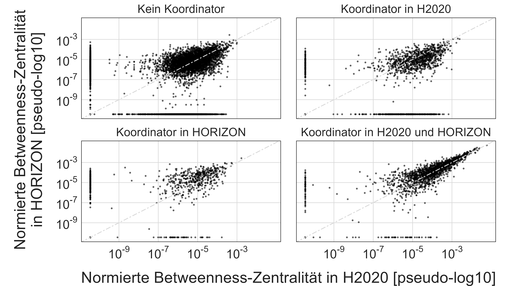
```

## Höchste Zentralität durchweg bei Koordination {.custom-smaller visibility="uncounted"}

```{r app-persistence-closeness, out.width="100%", fig.cap="Abbildung A13c: Entwicklung der Closeness-Zentralität von H2020 zu HORIZON hinsichtlich der Koordinatorentätigkeit einer Organisation in den jeweiligen Rahmenprogrammen."}
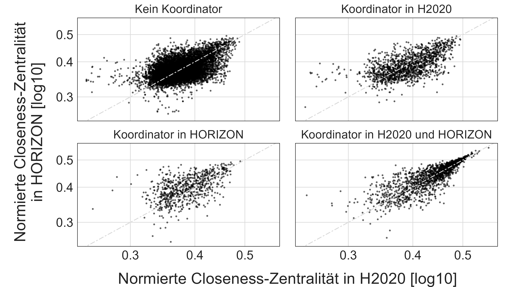
```

## Höchste Zentralität durchweg bei Koordination {.custom-smaller visibility="uncounted"}

```{r app-persistence-eigenvector, out.width="100%", fig.cap="Abbildung A13d: Entwicklung der Eigenvektor-Zentralität von H2020 zu HORIZON hinsichtlich der Koordinatorentätigkeit einer Organisation in den jeweiligen Rahmenprogrammen."}
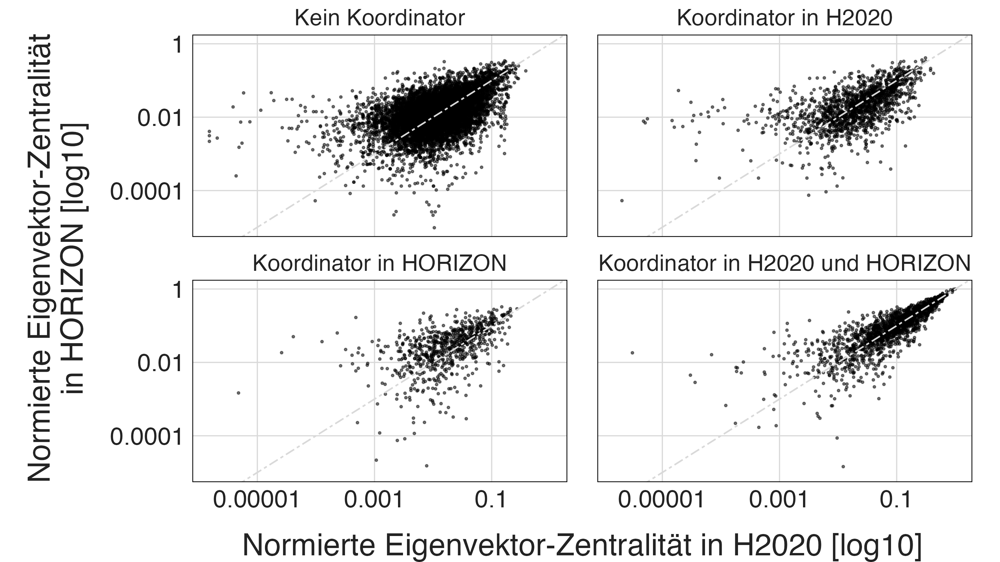
```

## Höchste Perzentile durchweg bei Koordination {.custom-smaller}

```{r app-persistence-percentile, out.width="100%", fig.cap="Abbildung A14: Entwicklung der Perzentile der Zentralitäten von H2020 zu HORIZON hinsichtlich der Koordinatorentätigkeit einer Organisation in den jeweiligen Rahmenprogrammen."}
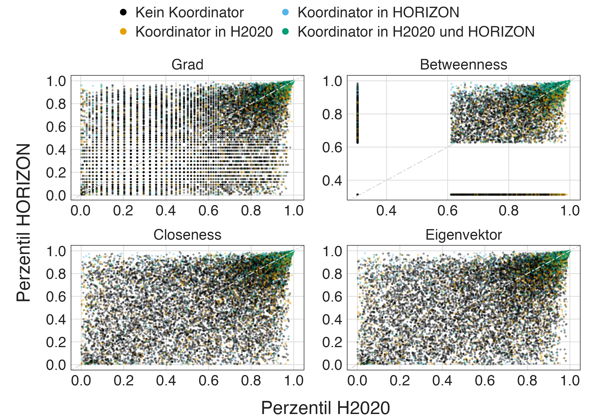
```

## Wenig Bewegung in Top-Ländern (~ Teilnahme) {.custom-smaller}

```{r app-countries-participation, out.width="100%"}
data <- data.frame(
  "rang"  = 1:10,
  "h2020_org" = c("Deutschland (4553)", "Spanien (4275)", "Italien (4004)", "Frankreich (3566)", "V. Königreich (3259)", "Niederlande (2502)", "Belgien (1780)", "Schweden (1193)", "Österreich (1135)", "Schweiz (1027)"),
  "h2020_proj" = c("Deutschland (20873)", "Spanien (18915)", "V. Königreich (17511)", "Italien (17237)", "Frankreich (17142)", "Niederlande (11164)", "Belgien (8465)", "Griechenland (5525)", "Schweden (5232)", "Schweiz (5174)"),
  "horizon_org" = c("Deutschland (3581)", "Spanien (3354)", "Frankreich (2946)", "Italien (2832)", "Niederlande (1937)", "V. Königreich (1703)", "Belgien (1638)", "Griechenland (1211)", "Portugal (952)", "Österreich (930)"),
  "horizon_proj" = c("Deutschland (15970)", "Spanien (15728)", "Italien (13520)", "Frankreich (13078)", "Niederlande (8777)", "Belgien (7819)", "V. Königreich (7779)", "Griechenland (6160)", "Schweden (4071)", "Österreich (4035)")
)

data %>%
  gt() %>%
  tab_caption(caption = "Tabelle A5: Länder mit höchsten Anzahl an Organisationen bzw. Projekten je Rahmenprogramm") %>%
  tab_options(table.font.size = px(24), table.layout = "auto") %>%
  cols_width(rang ~ pct(8), h2020_org ~ pct(22), h2020_proj ~ pct(24), horizon_org ~ pct(22), horizon_proj ~ pct(24)) %>%
  cols_align(align = "center", columns = everything()) %>%
  tab_spanner(label = "H2020", columns = c(h2020_org, h2020_proj)) %>%
  tab_spanner(label = "HORIZON", columns = c(horizon_org, horizon_proj)) %>%
  cols_label(
    rang         = md("Rang"),
    h2020_org    = md("Organisationen"),
    h2020_proj   = md("Projekte"),
    horizon_org  = md("Organisationen"),
    horizon_proj = md("Projekte")
  )
```

## Wenig Bewegung in Top-Ländern (~ Paarungen) {.custom-smaller}

```{r app-countries-collaborations-h2020, out.width="100%"}
data <- data.frame(
  "rank1"  = 1:10,
  "country1a" = c("Spanien", "Deutschland", "Deutschland", "Deutschland", "Spanien", "Frankreich", "Deutschland", "Deutschland", "Spanien", "Italien"),
  "country1b" = c("Italien", "Spanien", "Frankreich", "Italien", "Frankreich", "Italien", "V. Königreich", "Niederlande", "V. Königreich", "V. Königreich"),
  "value1"  = c(26731, 25509, 25236, 24160, 22034, 20362, 20235, 17261, 16621, 15795),
  "rank2"  = 1:10,
  "country2a" = c("Deutschland", "Deutschland", "Spanien", "Deutschland", "Spanien", "Deutschland", "Frankreich", "Deutschland", "Frankreich", "Spanien"),
  "country2b" = c("Frankreich", "Spanien", "Italien", "Italien", "Frankreich", "V. Königreich", "Italien", "Niederlande", "V. Königreich", "V. Königreich"),
  "value2"  = c(39941, 37728, 37564, 37148, 32338, 32125, 30974, 25280, 25039, 24453)
)

data %>%
  gt() %>%
  tab_caption(caption = "Tabelle A6a: Länderpaare mit meisten Kollaborationen für H2020") %>%
  tab_options(table.font.size = px(24)) %>%
  cols_align(align = "center", columns = everything()) %>%
  cols_width(rank1 ~ pct(8), country1a ~ pct(15), country1b ~ pct(15), value1 ~ pct(12), rank2 ~ pct(8), country2a ~ pct(15), country2b ~ pct(15), value2 ~ pct(12)) %>%
  tab_spanner(label = "Länder", columns = c(country1a, country1b), id = "sp_land1", level = 1) %>%
  tab_spanner(label = "Länder", columns = c(country2a, country2b), id = "sp_land2", level = 1) %>%
  tab_spanner(label = "nach Paaren an Organisationen", columns = c(rank1, country1a, country1b, value1), level = 2) %>%
  tab_spanner(label = "nach kollaborierten Projekten", columns = c(rank2, country2a, country2b, value2), level = 2) %>%
  cols_label(
    rank1 = md("Rang"), country1a = md(""), country1b = md(""), value1 = md("Wert"),
    rank2 = md("Rang"), country2a = md(""), country2b = md(""), value2 = md("Wert")
  )
```

## Wenig Bewegung in Top-Ländern (~ Paarungen) {.custom-smaller visibility="uncounted"}

```{r app-countries-collaborations-horizon, out.width="100%"}
data <- data.frame(
  "rank1"  = 1:10,
  "country1a" = c("Spanien", "Deutschland", "Deutschland", "Deutschland", "Spanien", "Frankreich", "Deutschland", "Belgien", "Griechenland", "Belgien"),
  "country1b" = c("Italien", "Spanien", "Frankreich", "Italien", "Frankreich", "Italien", "Niederlande", "Spanien", "Spanien", "Deutschland"),
  "value1"  = c(21420, 21077, 20607, 18157, 17789, 15639, 13334, 11644, 10997, 10931),
  "rank2"  = 1:10,
  "country2a" = c("Deutschland", "Spanien", "Deutschland", "Deutschland", "Spanien", "Frankreich", "Deutschland", "Belgien", "Belgien", "Griechenland"),
  "country2b" = c("Frankreich", "Italien", "Spanien", "Italien", "Frankreich", "Italien", "Niederlande", "Spanien", "Deutschland", "Spanien"),
  "value2"  = c(27690, 27426, 26949, 24005, 22846, 21318, 17895, 14879, 14308, 14098)
)

data %>%
  gt() %>%
  tab_caption(caption = "Tabelle A6b: Länderpaare mit meisten Kollaborationen für HORIZON") %>%
  tab_options(table.font.size = px(24)) %>%
  cols_align(align = "center", columns = everything()) %>%
  cols_width(rank1 ~ pct(8), country1a ~ pct(15), country1b ~ pct(15), value1 ~ pct(12), rank2 ~ pct(8), country2a ~ pct(15), country2b ~ pct(15), value2 ~ pct(12)) %>%
  tab_spanner(label = "Länder", columns = c(country1a, country1b), id = "sp_land1", level = 1) %>%
  tab_spanner(label = "Länder", columns = c(country2a, country2b), id = "sp_land2", level = 1) %>%
  tab_spanner(label = "nach Paaren an Organisationen", columns = c(rank1, country1a, country1b, value1), level = 2) %>%
  tab_spanner(label = "nach kollaborierten Projekten", columns = c(rank2, country2a, country2b, value2), level = 2) %>%
  cols_label(
    rank1 = md("Rang"), country1a = md(""), country1b = md(""), value1 = md("Wert"),
    rank2 = md("Rang"), country2a = md(""), country2b = md(""), value2 = md("Wert")
  )
```

## Überwiegende Führung der kleinen/teilnahmeschwachen Länder {.custom-smaller}

```{r app-ranking-centrality-h2020, out.width="100%", fig.cap="Abbildung A15a: Länder mit den höchsten mittleren Zentralitäten je Organisation in **H2020**."}
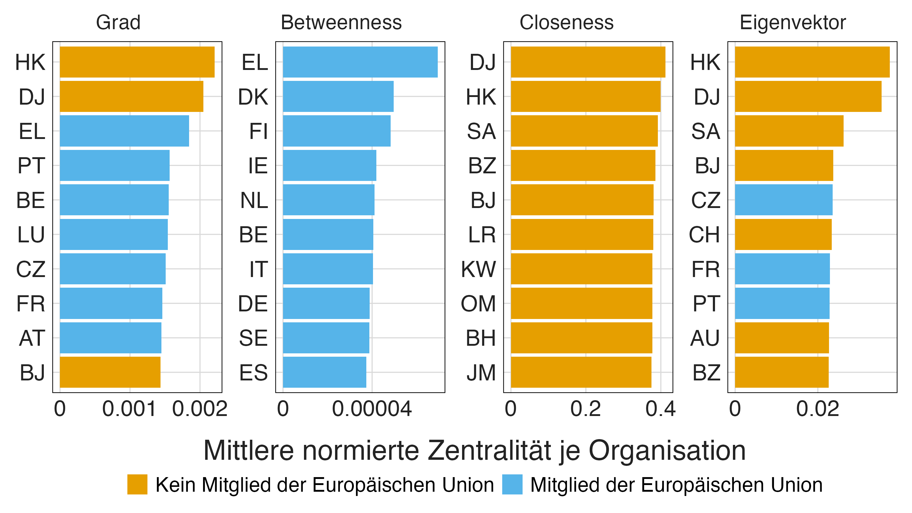
```

## Überwiegende Führung der kleinen/teilnahmeschwachen Länder {.custom-smaller visibility="uncounted"}

```{r app-ranking-centrality-horizon, out.width="100%", fig.cap="Abbildung A15b: Länder mit den höchsten mittleren Zentralitäten je Organisation in **HORIZON**."}
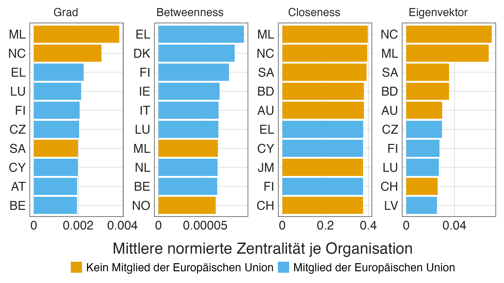
```

## Starke Schwankungen innerhalb Zentralitäten {.custom-smaller}

```{r app-rank-evolution-countries-mean, out.width="100%", fig.cap="Abbildung A16a: Entwicklung der Rangfolge der EU-Länder nach durchschnittlicher Zentralität je Organisation,<br>jeweils von H2020 (*je linke Spalte*) zu HORIZON (*je rechte Spalte*)."}
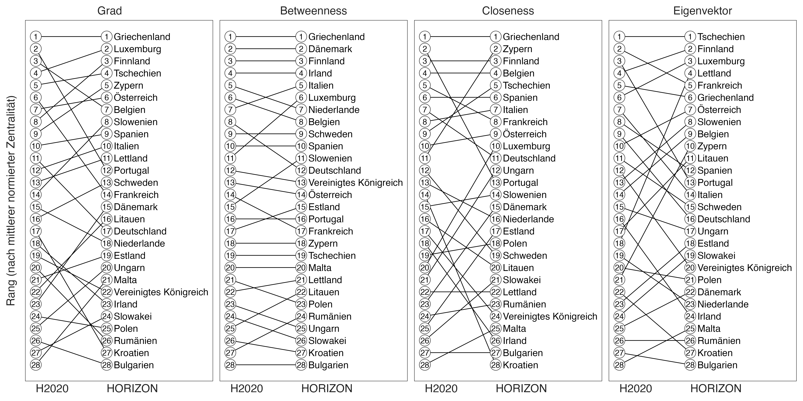
```

## Starke Schwankungen innerhalb Zentralitäten {.custom-smaller visibility="uncounted"}

```{r app-rank-evolution-countries-percapita, out.width="100%", fig.cap="Abbildung A16b: Entwicklung der Rangfolge der EU-Länder nach Zentralität pro Kopf,<br>jeweils von H2020 (*je linke Spalte*) zu HORIZON (*je rechte Spalte*)."}
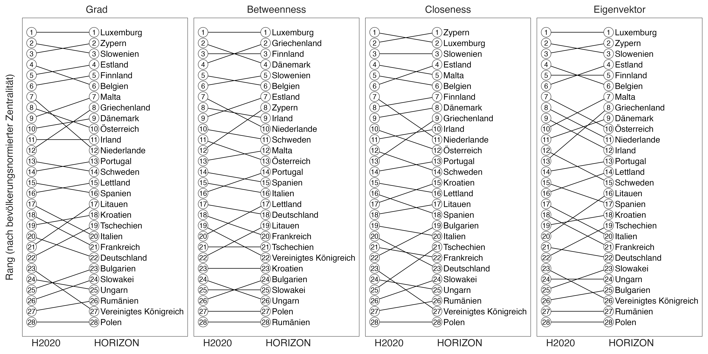
```

## Anteil an Gesamtzentralität & Landesgröße: positive Zusammenhänge {.custom-smaller}

```{r app-share-organisations, out.width="100%", fig.cap="Abbildung A17a: Anteil eines Landes an Gesamtzentralität gegen Größe des Landes in Form der<br>Anzahl an Organisationen für H2020 (*obere Zeile*) und HORIZON (*untere Zeile*)."}
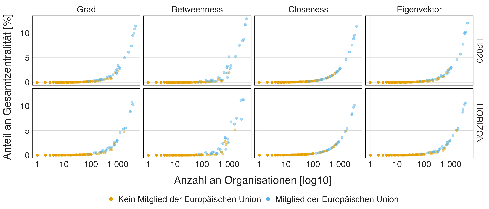
```

## Anteil an Gesamtzentralität & Landesgröße: geringfügig positive Zusammenhänge {.custom-smaller visibility="uncounted"}

```{r app-share-population, out.width="100%", fig.cap="Abbildung A17b: Anteil eines Landes an Gesamtzentralität gegen Größe des Landes in Form der Bevölkerungszahl für H2020 (*obere Zeile*) und HORIZON (*untere Zeile*)."}
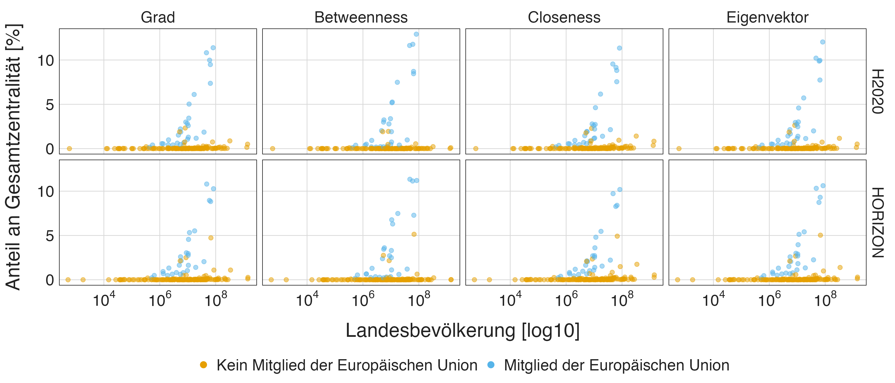
```

## Weltweite Vernetzung mit europäischem Fokus {.custom-smaller}

```{r app-map-world-h2020, out.width="100%", fig.cap="Abbildung A18a: Geographische Karte der weltweiten Kollaborationen auf Länderebene für **H2020**<br>in weltweiter Darstellung. Kanten: Vereinigung aus maximalem Spannbaum und $n-1$ stärksten Gewichten.<br>Knotengröße: Anzahl Verbindungen. Kantenbreite: Anzahl gemeinsame Projekte."}
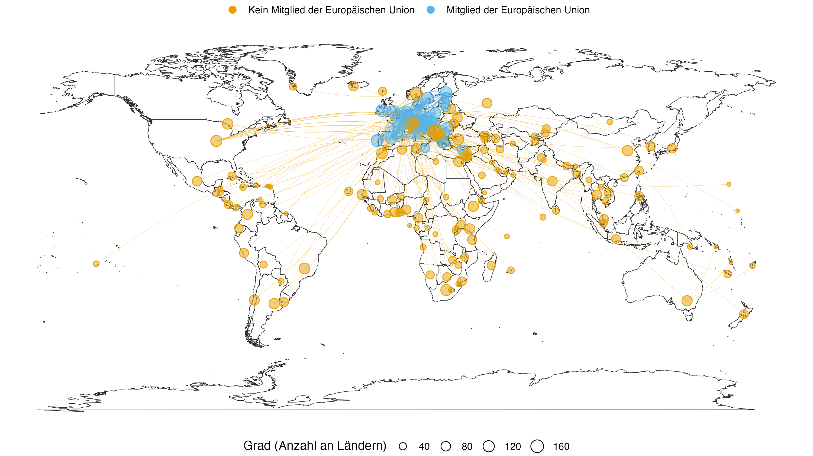
```

## Stark vernetzter west-/mitteleuropäischer Kern {.custom-smaller}

```{r app-map-world-h2020-zoomed, out.width="100%", fig.cap="Abbildung A18b: Geographische Karte der weltweiten Kollaborationen auf Länderebene für **H2020**<br>mit weltweiten Verbindungen unter europäischem Fokus des Sichtfelds. Kanten: Vereinigung aus<br>maximalem Spannbaum und $n-1$ stärksten Gewichten. Knotengröße: Anzahl Verbindungen.<br> Kantenbreite: Anzahl gemeinsame Projekte."}
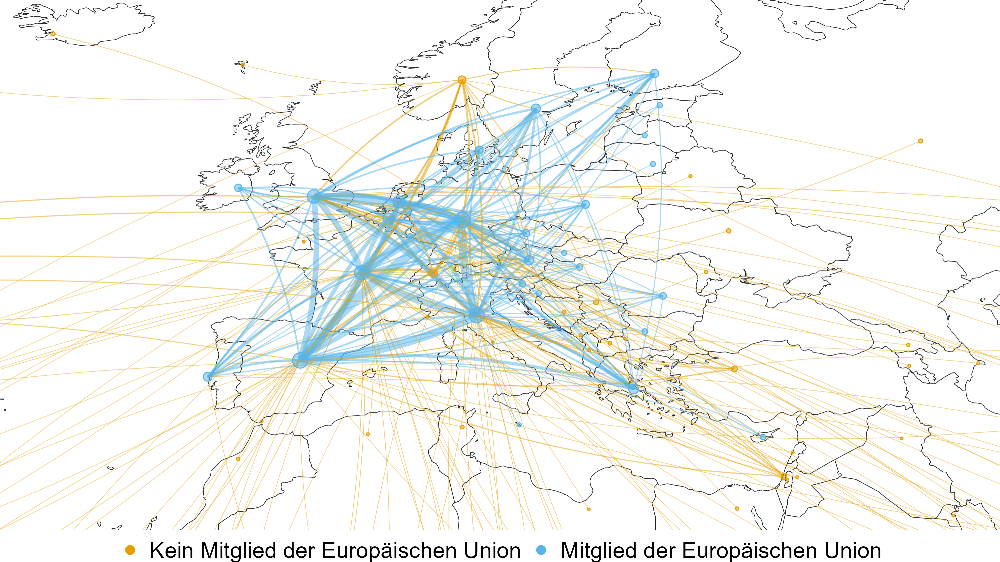
```

## Weltweite Vernetzung mit europäischem Fokus {.custom-smaller}

```{r app-map-world-horizon, out.width="100%", fig.cap="Abbildung A18c: Geographische Karte der weltweiten Kollaborationen auf Länderebene für **HORIZON**<br>in weltweiter Darstellung. Kanten: Vereinigung aus maximalem Spannbaum und $n-1$ stärksten Gewichten.<br>Knotengröße: Anzahl Verbindungen. Kantenbreite: Anzahl gemeinsame Projekte."}
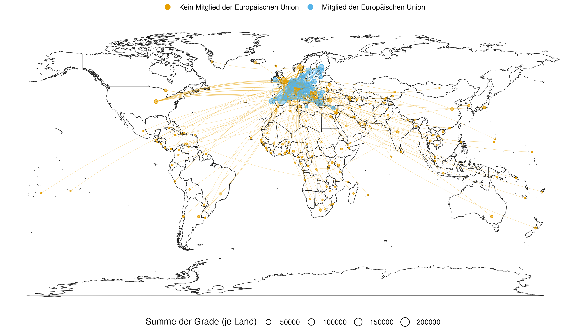
```

## Stark vernetzter west-/mitteleuropäischer Kern {.custom-smaller}

```{r app-map-world-horizon-zoomed, out.width="100%", fig.cap="Abbildung A18d: Geographische Karte der weltweiten Kollaborationen auf Länderebene für **HORIZON**<br>mit weltweiten Verbindungen unter europäischem Fokus des Sichtfelds. Kanten: Vereinigung aus<br>maximalem Spannbaum und $n-1$ stärksten Gewichten. Knotengröße: Anzahl Verbindungen.<br>Kantenbreite: Anzahl gemeinsame Projekte."}
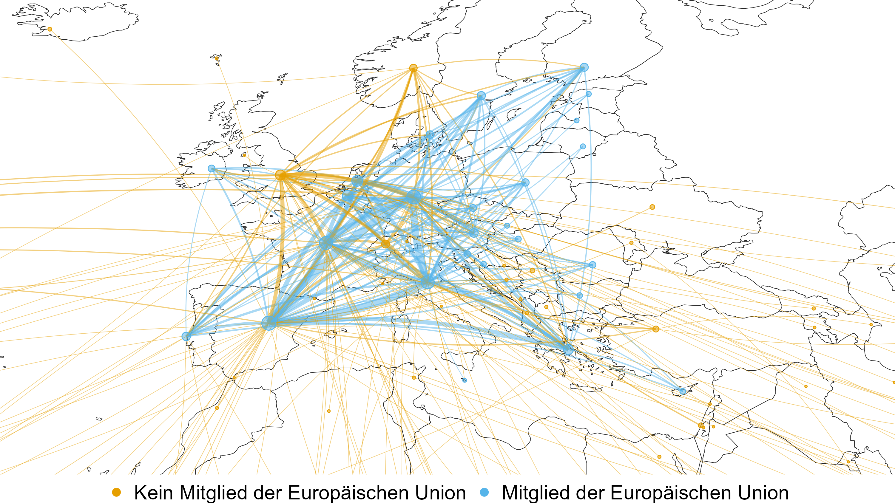
```

## Außen einzeln über Brücken mit Kern verbunden {.custom-smaller}

```{r app-abstract-world-h2020, out.width="100%", fig.cap="Abbildung A19a: Kräftebasierte Positionierung der weltweiten Kollaborationen auf Länderebene für **H2020**<br>mittels Fruchterman-Reingold. Kanten: Vereinigung aus maximalem Spannbaum und $n-1$ stärksten Gewichten. Knotengröße: Anzahl Verbindungen. Kantenbreite: Anzahl gemeinsame Projekte."}
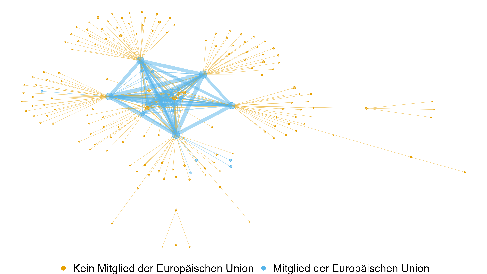
```

## Außen einzeln über Brücken mit Kern verbunden {.custom-smaller}

```{r app-abstract-world-horizon, out.width="100%", fig.cap="Abbildung A19b: Kräftebasierte Positionierung der weltweiten Kollaborationen auf Länderebene für **HORIZON**<br>mittels Fruchterman-Reingold. Kanten: Vereinigung aus maximalem Spannbaum und $n-1$ stärksten Gewichten. Knotengröße: Anzahl Verbindungen. Kantenbreite: Anzahl gemeinsame Projekte."}
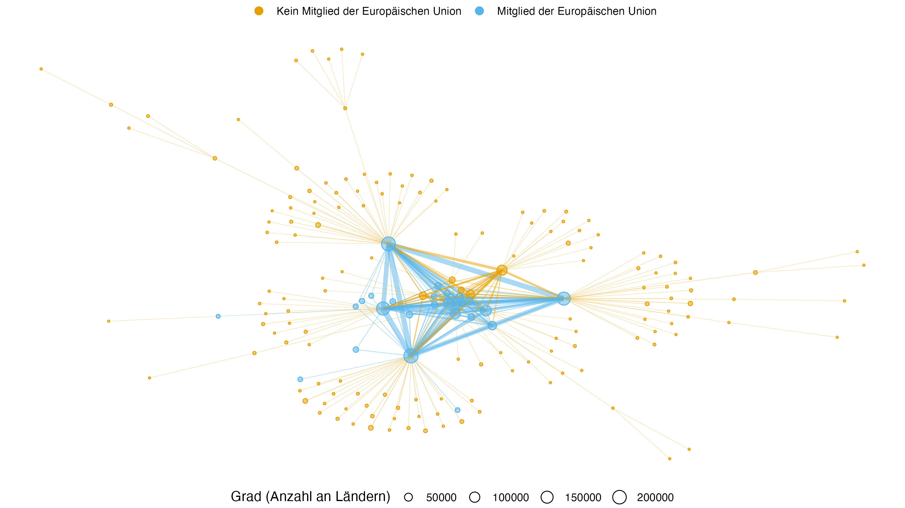
```

## Einfluss der geographischen Lage auf Affinität {.custom-smaller}

```{r app-relatedness-h2020, out.width="100%", fig.cap="Abbildung A20a: Kräftebasierte Positionierung der Kollaborationen auf Länderebene für **H2020**<br>mittels Fruchterman-Reingold. Farbliche Gruppierung mittels Louvain-Methode über *Relatedness*.<br>Kanten: $k$ = 4 am meisten bevorzugten Verbindungen je Land. Knotengröße: Anzahl Verbindungen.<br>Kantenart: einseitige (*gepunktet*) oder beidseitige (*durchgezogen*) Affinität."}
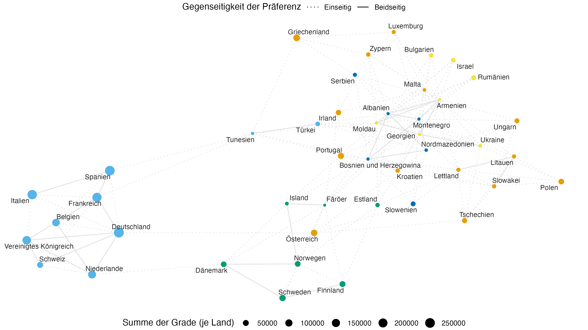
```

## Einfluss der geographischen Lage auf Affinität {.custom-smaller visibility="uncounted"}

```{r app-relatedness-horizon, out.width="100%", fig.cap="Abbildung A20b: Kräftebasierte Positionierung der Kollaborationen auf Länderebene für **HORIZON**<br>mittels Fruchterman-Reingold. Farbliche Gruppierung mittels Louvain-Methode über *Relatedness*.<br>Kanten: $k$ = 4 am meisten bevorzugten Verbindungen je Land. Knotengröße: Anzahl Verbindungen.<br>Kantenart: einseitige (*gepunktet*) oder beidseitige (*durchgezogen*) Affinität."}
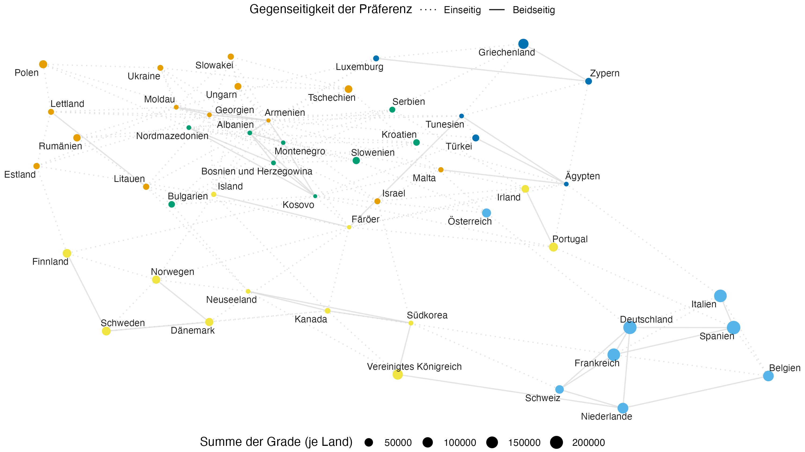
```

## Minimale Distanzen & überlagernde Positionen {.custom-smaller}

```{r app-mds, out.width="100%", fig.cap="Abbildung A21a: Distanzbasierte Positionierung auf Länderebene mittels multidimensionaler Skalierung<br>für H2020 (*links*) und HORIZON (*rechts*) unter Betrachtung der vollen Dimensionen."}
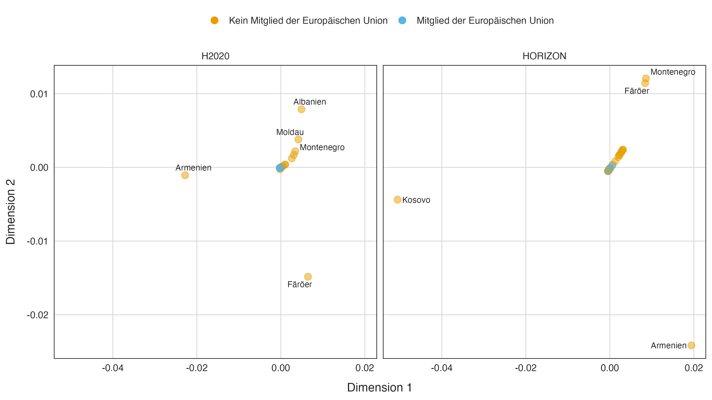
```

## Minimale Distanzen & überlagernde Positionen {.custom-smaller visibility="uncounted"}

```{r app-mds-zoomed, out.width="100%", fig.cap="Abbildung A21b: Distanzbasierte Positionierung auf Länderebene mittels multidimensionaler Skalierung<br>für H2020 (*links*) und HORIZON (*rechts*) unter vergrößerter Sicht auf rund um den Koordinatenursprung."}
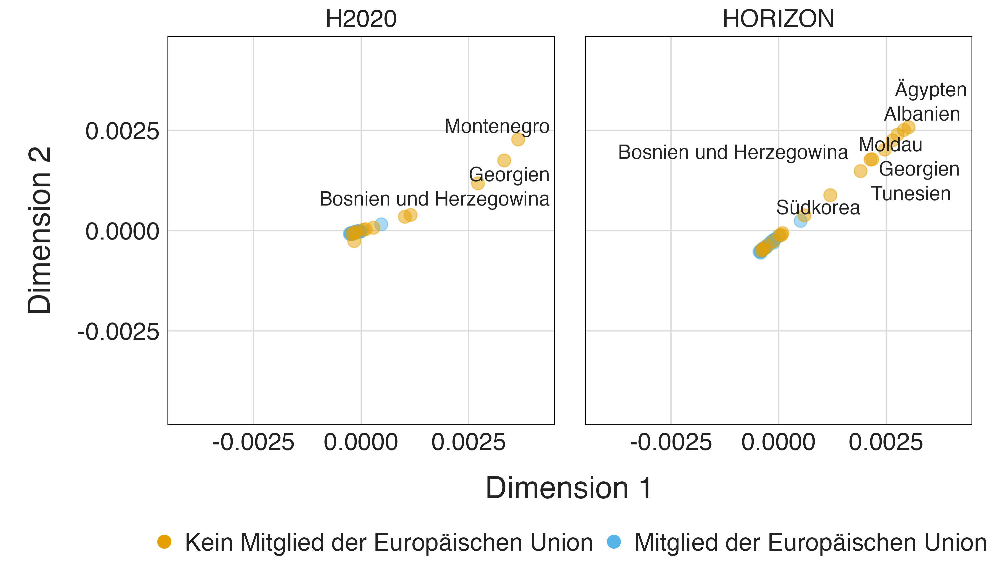
```